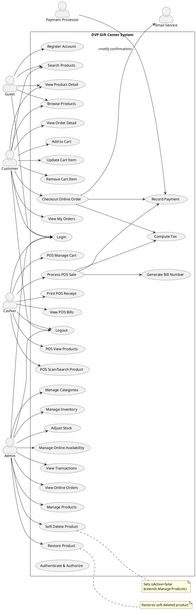
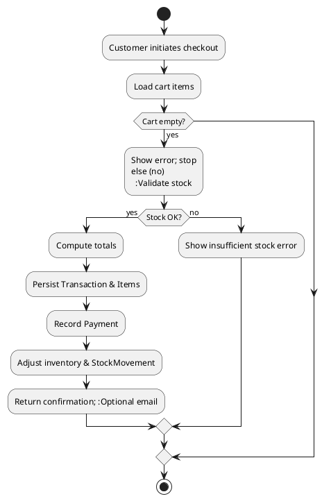
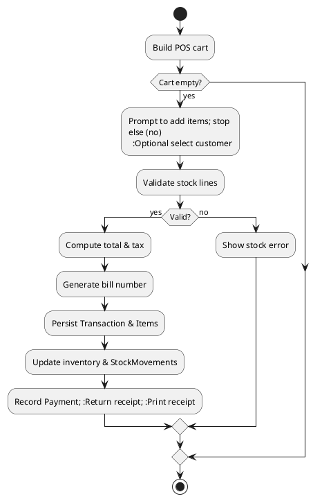
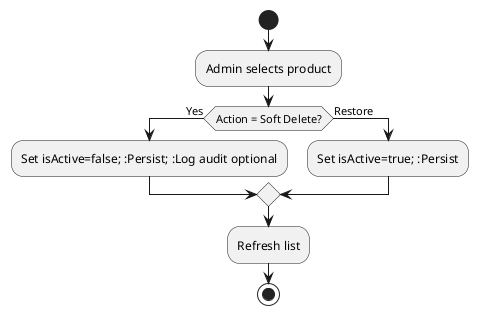
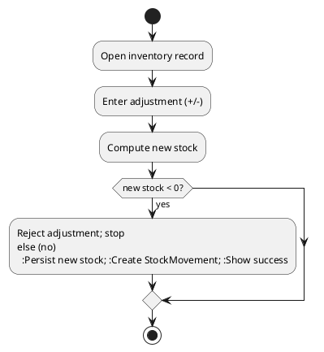
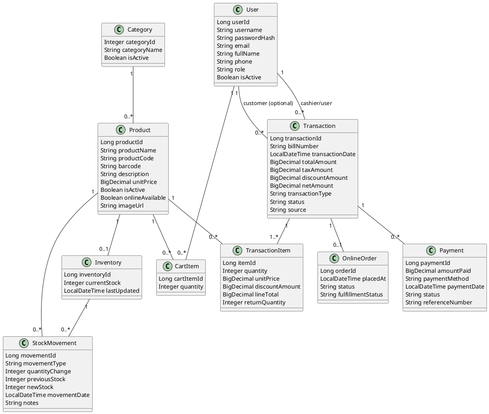

# System Analysis & Design Documentation

## 1. Overview
This document captures the functional analysis of the DVP Gift Center system covering Customer web storefront, Cashier POS, and Admin back‑office capabilities. It includes: actors, use case diagram, comprehensive use case list & scenarios, activity diagrams, and a domain class diagram.

## 2. Actors
Primary Actors:
- **Guest** – Unauthenticated visitor who can browse and search products, then register/login.
- **Customer** – Authenticated user purchasing via the online storefront.
- **Cashier** – In‑store staff operating the POS to process walk‑in or registered customer sales.
- **Admin** – Manages products, categories, inventory, availability, transactions, and orders.
- **Payment Processor** (external conceptual) – Represents payment capture (currently internal simulation).
- **Email Service** (conceptual) – Future integration for order confirmation notifications.

Secondary/Internal Actors:
- **Authentication Service** – Issues and validates JWT tokens.
- **Inventory System** – Internal responsibility for up-to-date stock levels and movements.

## 3. High-Level Use Case Diagram (PlantUML)

## 4. Use Case Catalogue (Summary)
| Use Case | Description | Actor(s) |
|----------|-------------|----------|
| Register Account | Create new customer profile | Guest |
| Login | Authenticate and obtain JWT | Guest, Customer, Cashier, Admin |
| Logout | End session client-side | All authenticated |
| Browse Products | Paginated viewing of active products | Guest, Customer |
| Search Products | Query products by text/barcode | Guest, Customer |
| View Product Detail | Detailed product info | Guest, Customer |
| Add to Cart | Add item to cart | Customer |
| Update Cart Item | Change quantity in cart | Customer |
| Remove Cart Item | Remove cart item | Customer |
| Checkout Online Order | Place online order & payment | Customer |
| View My Orders | List customer orders | Customer |
| View Order Detail | Detailed order display | Customer |
| POS View Products | Product list for POS | Cashier |
| POS Scan/Search Product | Quick lookup via barcode/text | Cashier |
| POS Manage Cart | Add/update/remove POS cart lines | Cashier |
| Process POS Sale | Complete in-store sale | Cashier |
| Print POS Receipt | Generate printable receipt | Cashier |
| View POS Bills | List previous POS transactions | Cashier |
| Manage Products | CRUD + pricing | Admin |
| Soft Delete Product | Mark inactive (logical delete) | Admin |
| Restore Product | Reactivate product | Admin |
| Manage Categories | CRUD categories | Admin |
| Manage Inventory | View/update stock | Admin |
| Adjust Stock | Manual stock adjustment + audit | Admin |
| Manage Online Availability | Toggle online listing | Admin |
| View Transactions | List transactions (POS/online) | Admin |
| View Online Orders | View customers' online orders | Admin |
| Authenticate & Authorize | Role-based access control | System |
| Compute Tax | Apply configured tax rate | System |
| Generate Bill Number | Create unique bill identifier | System |
| Record Payment | Store payment data | System |

## 5. Detailed Use Case Scenarios

### 5.1 Register Account
**Actor:** Guest  
**Preconditions:** Not authenticated.  
**Main Flow:** 1) Open form 2) Enter details 3) Validate uniqueness 4) Hash & store user (ROLE_CUSTOMER) 5) Success response.  
**Alternates:** Username/email exists → error.  
**Postconditions:** Customer account created.

### 5.2 Login
**Actors:** Guest/Customer/Cashier/Admin  
**Main:** Submit credentials → validate → issue JWT.  
**Alt:** Invalid credentials → unauthorized.

### 5.3 Browse Products
Retrieve active products list (paginated). Empty list if none.

### 5.4 Search Products
Search by name/code/barcode; return matching active products.

### 5.5 View Product Detail
Return details for selected product (if active).

### 5.6 Add to Cart
Check product active and optionally stock → create/update cart item.

### 5.7 Update Cart Item
Validate quantity >0 and ≤ available stock → persist.

### 5.8 Remove Cart Item
Delete the cart item; recalc summary.

### 5.9 Checkout Online Order
**Preconditions:** Authenticated; cart not empty.  
**Main:** Validate stock → compute totals (subtotal+tax) → persist Transaction (+items, source=online_sale) → record Payment → decrement inventory + StockMovements → confirmation → (optional email).  
**Alt:** Stock fail; Payment failure.  
**Post:** Order placed, inventory updated.

### 5.10 View My Orders
List customer's transactions with source=online_sale.

### 5.11 View Order Detail
Return items, payment, amounts.

### 5.12 POS View Products
List active products with current stock for POS.

### 5.13 POS Scan/Search Product
Barcode or text search to retrieve one or multiple products.

### 5.14 POS Manage Cart
Add/remove/update line items; enforce stock.

### 5.15 Process POS Sale
**Preconditions:** POS cart not empty.  
**Main:** Optional customer selection (nullable) → validate stock → compute totals & tax → generate bill # → persist transaction & items (source=pos_sale) → update inventory & StockMovements → record payment → return receipt DTO.  
**Alt:** Stock failure; payment error.  
**Post:** Inventory updated; sale recorded.

### 5.16 Print POS Receipt
Fetch receipt DTO and render/print.

### 5.17 View POS Bills
Filter last POS transactions by bill or date range (top N default).

### 5.18 Manage Products
CRUD operations with validation and online availability toggles.

### 5.19 Soft Delete Product
Set isActive=false (retains historical references). Restore possible.

### 5.20 Restore Product
Set isActive=true; product becomes available again.

### 5.21 Manage Categories
CRUD for categories used in product classification.

### 5.22 Manage Inventory / Adjust Stock
Manual adjustments create StockMovement with before/after counts.

### 5.23 Manage Online Availability
Enable/disable product for online storefront without disabling product entirely.

### 5.24 View Transactions
Admin lists transactions; may filter by source (POS/online).

### 5.25 View Online Orders
Admin reviews customer orders for fulfillment/resolution.

### 5.26 Record Payment (Internal)
Persist payment details and link to transaction.

### 5.27 Compute Tax (Internal)
Apply configured rate (e.g., `app.tax.rate`) during sale computations.

### 5.28 Generate Bill Number (Internal)
Format: `DVPYYYYMMDD####` (daily sequence).

## 6. Activity Diagrams

### 6.1 Online Checkout

### 6.2 POS Transaction

### 6.3 Product Soft Delete / Restore

### 6.4 Inventory Adjustment

## 7. Domain Class Diagram

## 8. Traceability Matrix (Use Cases → Classes)
| Use Case | Key Classes |
|----------|-------------|
| Checkout Online Order | CartItem, Product, Inventory, Transaction, TransactionItem, Payment, StockMovement, User |
| Process POS Sale | Product, Inventory, Transaction, TransactionItem, Payment, StockMovement, User |
| Manage Products | Product, Category |
| Soft Delete / Restore | Product |
| Adjust Stock | Inventory, StockMovement, Product |
| View POS Bills | Transaction, TransactionItem, Payment |
| View My Orders | Transaction, TransactionItem, Payment |
| Print POS Receipt | Transaction, TransactionItem, Payment |
| Browse/Search Products | Product, Category |

## 9. Non-Functional Considerations
- **Security:** JWT + role-based access (ROLE_ADMIN, ROLE_CASHIER, ROLE_CUSTOMER).
- **Consistency:** Inventory and stock movements updated atomically in transaction boundary.
- **Auditability:** StockMovement retains before/after counts.
- **Extensibility:** Walk-in customers supported with nullable customer in `Transaction`.
- **Performance:** Simple queries; indexes recommended on `bill_number`, `barcode`, `product_code`.

## 10. Future Enhancements
- External payment gateway integration.
- Email/SMS notification service.
- Reporting dashboards (low stock, daily sales KPIs).
- Customer loyalty / discount engine.
- Batch import/export for products and inventory.

---
*End of Document*
