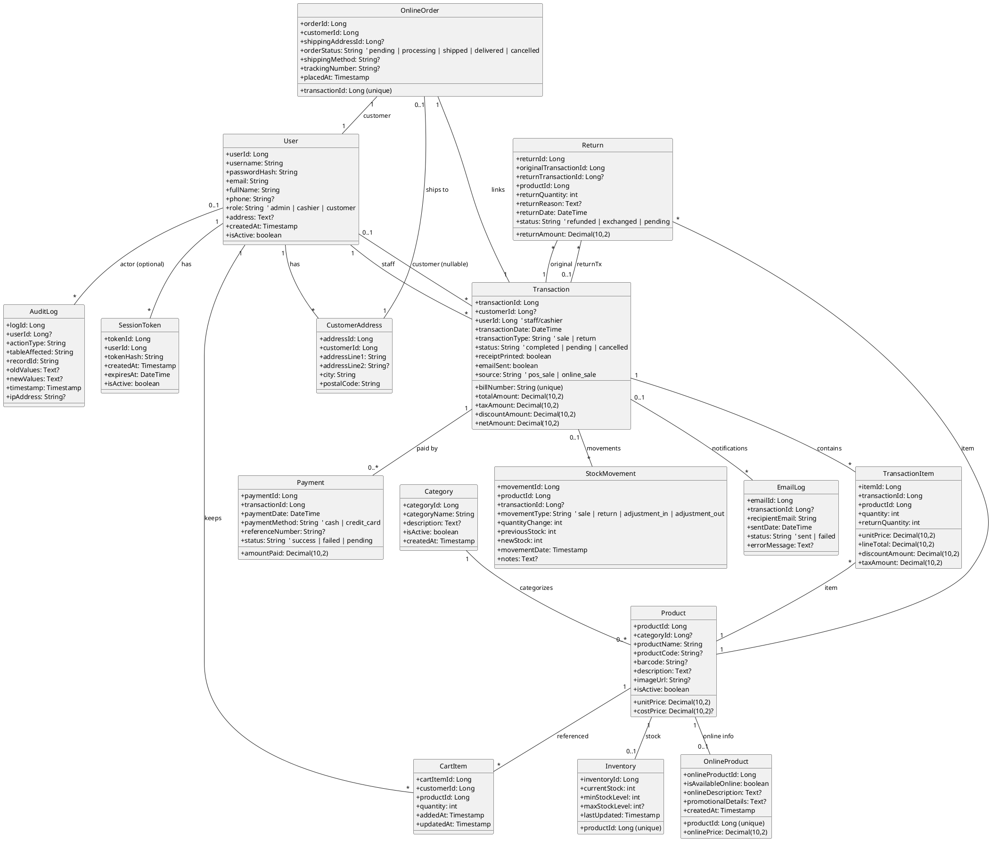

# System Diagrams (PlantUML)

Date: 2025-10-09  
Version: 1.0

This file provides full-system diagrams as PlantUML code blocks you can render directly.

---
## 1) Entire System Use Case Diagram (PlantUML)
```plantuml
@startuml
left to right direction

actor Admin
actor Cashier
actor Customer

rectangle "Gift Center System" {
  (Manage Categories) as UC_Admin_ManageCategories
  (Manage Products) as UC_Admin_ManageProducts
  (Manage Users) as UC_Admin_ManageUsers
  (Configure System Settings) as UC_Admin_Config
  (View All Orders) as UC_Admin_ViewOrders
  (Update Order Status) as UC_Admin_UpdateOrderStatus
  (View Transactions) as UC_Admin_ViewTransactions

  (Process POS Sale) as UC_Cashier_ProcessSale
  (Search Product (Barcode/SKU)) as UC_Cashier_Search
  (List POS Transactions) as UC_Cashier_ListTx
  (Reprint POS Receipt) as UC_Cashier_Reprint

  (Register Account) as UC_Cust_Register
  (Authenticate User) as UC_Cust_Login
  (Browse & Filter Products) as UC_Cust_Browse
  (Search Products) as UC_Cust_Search
  (View Product Detail) as UC_Cust_ViewDetail
  (Manage Cart) as UC_Cust_Cart
  (Checkout Order) as UC_Cust_Checkout
  (View My Orders) as UC_Cust_ViewMyOrders
  (View Order Detail) as UC_Cust_ViewOrderDetail
}

Admin --> UC_Admin_ManageCategories
Admin --> UC_Admin_ManageProducts
Admin --> UC_Admin_ManageUsers
Admin --> UC_Admin_Config
Admin --> UC_Admin_ViewOrders
Admin --> UC_Admin_UpdateOrderStatus
Admin --> UC_Admin_ViewTransactions

Cashier --> UC_Cashier_ProcessSale
Cashier --> UC_Cashier_Search
Cashier --> UC_Cashier_ListTx
Cashier --> UC_Cashier_Reprint

Customer --> UC_Cust_Register
Customer --> UC_Cust_Login
Customer --> UC_Cust_Browse
Customer --> UC_Cust_Search
Customer --> UC_Cust_ViewDetail
Customer --> UC_Cust_Cart
Customer --> UC_Cust_Checkout
Customer --> UC_Cust_ViewMyOrders
Customer --> UC_Cust_ViewOrderDetail

UC_Cashier_ProcessSale --> UC_Cashier_Search : <<include>>
UC_Cust_Checkout --> UC_Cust_Login : <<include>>
UC_Cust_Cart --> UC_Cust_ViewDetail : <<extend>>
@enduml
```

Notes:
- Scope includes implemented features only (no external payment gateway, no COD).
- Admin transactions view is read-only in current build; exports/aggregates are future.

---
## 2) Entire System Class Diagram (PlantUML)

Derived from `database/dvp_gift_center_schema.sql` (tables, PKs/FKs, relationships).



Assumptions:
- Names and types mirror the SQL schema; optional fields indicated with `?`.
- `OnlineOrder` is a 1:1 extension of `Transaction` for online sales (by `transaction_id`).
- `Transaction.customerId` is nullable for POS walk-in; `Transaction.userId` is staff/cashier.

---
## Render Instructions

You can render these diagrams with PlantUML (locally or via an online renderer):

```powershell
# On Windows (if Java & PlantUML jar available):
java -jar plantuml.jar .\docs\SYSTEM_DIAGRAMS.md
```

Or paste each code block into any PlantUML editor/renderer.
