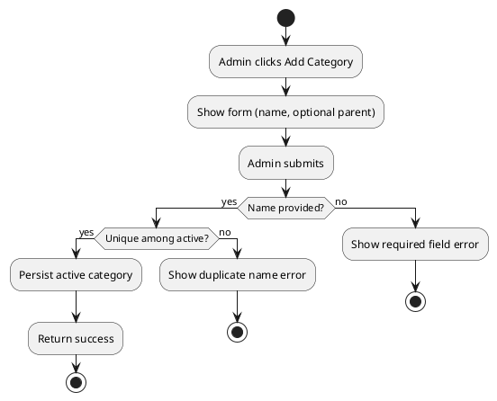
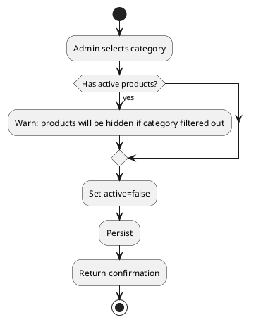
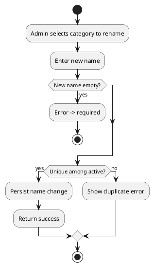

# Admin Use Case: Manage Categories

Date: 2025-10-09  
Version: 1.0  
Actor: Admin  
Scope: Create, update, deactivate product categories to organize catalog hierarchy and control product grouping & filtering.

## 1. Goals
Maintain a clean and navigable taxonomy enabling customers and POS operators to locate products efficiently while preserving historical associations.

## 2. Triggers
- New product line introduction.
- Category rename for branding.
- Retirement/merge of obsolete category.

## 3. Stakeholders
| Stakeholder | Interest |
|-------------|----------|
| Admin | Flexible taxonomy management |
| Customer | Intuitive browsing |
| Cashier | Logical grouping in POS (optional grouping) |
| Analytics | Stable category IDs for reporting |

## 4. Preconditions
- Admin authenticated.
- Database reachable.

## 5. Postconditions
- Category changes persisted.
- Inactive category hidden from future product assignments (unless reactivated).
- Products retain historical category reference unless migrated.

## 6. Business Rules
| Rule ID | Description |
|---------|-------------|
| BR-CAT-UNQ-1 | Category name must be unique among active categories. |
| BR-CAT-ROOT-1 | Root (top-level) vs subcategory distinction maintained (if hierarchy introduced later). |
| BR-CAT-DEL-1 | Deactivation preferred over hard delete; active products cannot belong to inactive category (enforce at product query). |
| BR-CAT-RENAME-1 | Renaming updates display name only; ID remains stable. |
| BR-CAT-AUDIT-1 | Track created_at/updated_at. |

## 7. Main Success Scenario (Create Category)
1. Admin selects "Add Category".
2. System presents name (and optional parent) fields.
3. Admin enters name.
4. System validates uniqueness (BR-CAT-UNQ-1).
5. System persists category active=true.
6. Confirmation displayed.

## 8. Alternate Flows
| Flow ID | Description | Variation Point |
|---------|-------------|-----------------|
| A1 | Duplicate name | Step 4: Reject with error |
| A2 | Rename category | Update scenario: Validate new name uniqueness |
| A3 | Deactivate category | Set active=false; affects product visibility logic |
| A4 | Reactivate category | Requires no conflicting active name |
| A5 | Attempt to delete (future) | System suggests deactivate instead |

## 9. Activity Diagrams
### 9.1 Create Category

### 9.2 Deactivate Category

### 9.3 Rename Category

## 10. Non-Functional Requirements
- Fast list retrieval (< 300ms typical) due to small table size.
- Index on (name, active) for validation.

## 11. Open Issues
| ID | Issue | Impact | Resolution |
|----|-------|--------|-----------|
| O1 | No hierarchical parent field yet | Limits taxonomy depth | Add parent_id column later |
| O2 | Hard delete policy undefined | Data consistency risk | Decide retention rule |

## 12. Conversion
`pandoc .\\docs\\admin\\ADMIN_MANAGE_CATEGORIES.md -o .\\docs\\admin\\ADMIN_MANAGE_CATEGORIES.docx`

---
End of Document.
