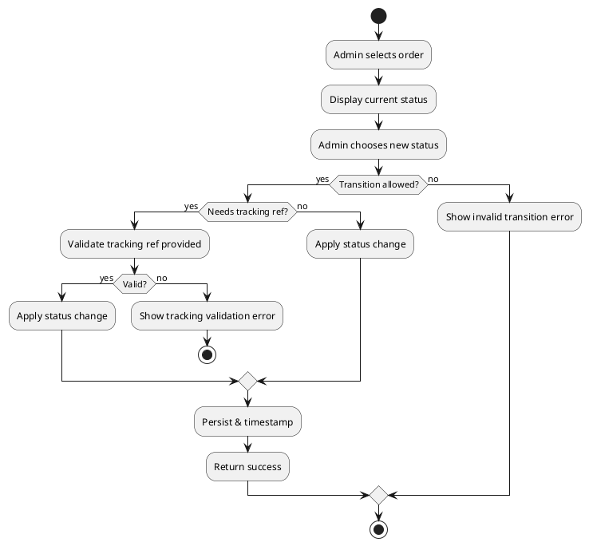
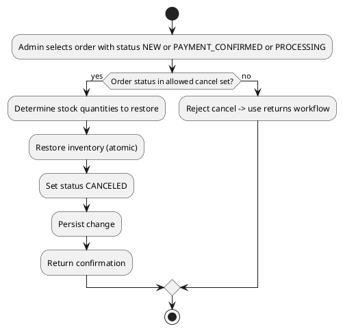
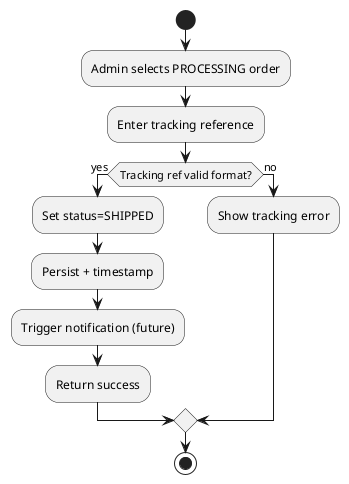

# Admin Use Case: Manage Orders

Date: 2025-10-09  
Version: 1.0  
Actor: Admin  
Scope: Review, filter, and update customer e-commerce orders across lifecycle statuses.

## 1. Goals
Provide controlled transitions of order status ensuring inventory integrity, timely fulfillment, and accurate customer communication.

## 2. Triggers
- New order placed (status NEW/PENDING_PAYMENT).
- Payment confirmation received.
- Shipment prepared/dispatched.
- Customer cancellation request.
- Administrative override (fraud, stock issue).

## 3. Stakeholders
| Stakeholder | Interest |
|-------------|----------|
| Admin | Accurate status control |
| Customer | Reliable delivery expectations |
| Warehouse | Clear pick/pack instructions |
| Finance | Proper payment capture & refunds |

## 4. Preconditions
- Admin authenticated.
- Orders exist in system.
- Status transition matrix defined.

## 5. Postconditions
- Order status updated (if valid transition) with timestamp.
- Inventory adjustments applied for cancellation before shipment.
- Audit log entry (future enhancement) captured.

## 6. Status Model (Example)
NEW -> PAYMENT_CONFIRMED -> PROCESSING -> SHIPPED -> COMPLETED

Alternative transitions:  
- NEW -> CANCELED  
- PAYMENT_CONFIRMED -> CANCELED (refund needed)  
- PROCESSING -> CANCELED (manual stock restore)  
- SHIPPED -> RETURN_REQUESTED -> REFUNDED (future)  

## 7. Business Rules
| Rule ID | Description |
|---------|-------------|
| BR-ORD-TRANS-1 | Only defined transitions allowed. |
| BR-ORD-PAY-1 | Cannot move to PROCESSING unless payment confirmed. |
| BR-ORD-CAN-1 | Cancellation after SHIPPED requires returns workflow (future). |
| BR-ORD-STOCK-1 | Cancellation pre-shipment restores inventory quantities. |
| BR-ORD-AUDIT-1 | Every status change must store who & when (future). |

## 8. Main Success Scenario (Advance Order to Shipped)
1. Admin filters orders with status PROCESSING.
2. Selects an order ready to ship.
3. Enters tracking/shipment reference.
4. System validates current status & required fields.
5. System updates status to SHIPPED with timestamps.
6. Confirmation returned.

## 9. Alternate / Extension Flows
| Flow ID | Description | Variation Point |
|---------|-------------|-----------------|
| A1 | Invalid transition | Step 4: Reject with BR-ORD-TRANS-1 message |
| A2 | Missing tracking info | Step 4: Reject until provided |
| A3 | Cancel order (pre-shipment) | Separate cancellation flow |
| A4 | Payment not confirmed | Step 4: Block; require status PAYMENT_CONFIRMED |
| A5 | Force override (fraud) | Admin sets CANCELED with reason code |

## 10. Activity Diagrams
### 10.1 Update Order Status (Generic)

### 10.2 Cancel Order Pre-Shipment

### 10.3 Advance to Shipped

## 11. Non-Functional Requirements
- Transition validation < 200ms.
- High consistency; use transactional boundary for status + stock.

## 12. Open Issues
| ID | Issue | Impact | Proposed Resolution |
|----|-------|--------|---------------------|
| O1 | No explicit status table | Hard-coded logic | Introduce status reference table |
| O2 | No audit entity | Compliance risk | Add order_status_history |
| O3 | No returns flow yet | Limited post-shipment control | Implement returns use case |

## 13. Conversion
`pandoc .\\docs\\admin\\ADMIN_MANAGE_ORDERS.md -o .\\docs\\admin\\ADMIN_MANAGE_ORDERS.docx`

---
End of Document.
