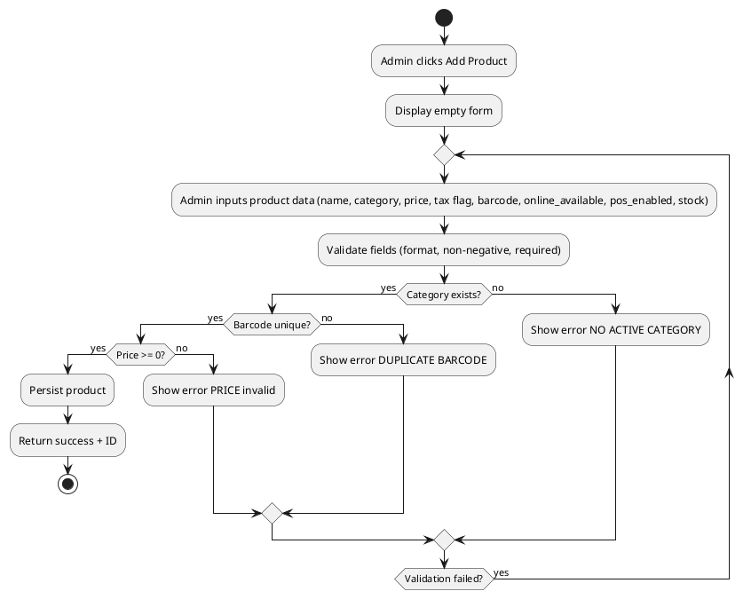
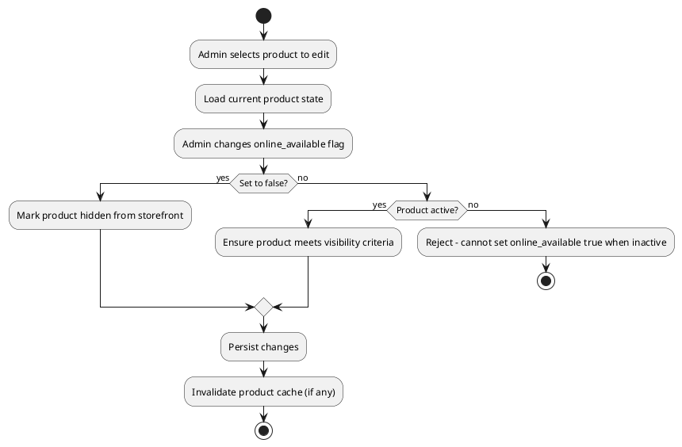
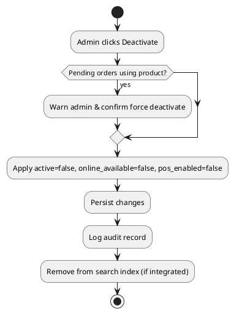
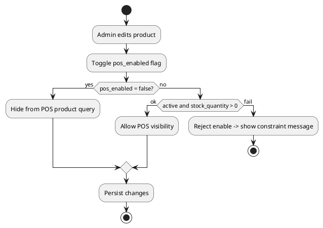

# Admin Use Case: Manage Products

Date: 2025-10-09  
Version: 1.0  
Actor: Admin  
Scope: Internal management of product catalog including online availability, pricing, stock metadata, activation lifecycle, and compliance constraints.

## 1. Goals
Enable the Admin to create, update, deactivate, and control online availability & POS visibility of products while ensuring data integrity (unique barcode/SKU), correct tax configuration, and synchronized stock readiness.

## 2. Primary Triggers
- New product introduction.
- Price / tax change directive.
- Need to toggle online availability (temporarily hide from storefront) without removing POS availability.
- Product retirement or recall (deactivation).

## 3. Stakeholders & Interests
| Stakeholder | Interest |
|-------------|----------|
| Admin | Accurate, fast catalog maintenance |
| Cashier | Reliable POS product list |
| Customer | Up-to-date product data & visibility |
| Finance | Correct pricing & tax calculations |
| Inventory Control | Stock alignment with product lifecycle |

## 4. Preconditions
- Admin authenticated with role=ADMIN.
- At least one active category exists for product assignment (for new entries).
- System configuration (tax rate, currency) loaded.

## 5. Postconditions
- Product changes persisted with audit timestamps.
- Online availability flag respected by customer-facing APIs.
- Deactivated products excluded from POS & online queries (depending on rules below).

## 6. Business Rules
| Rule ID | Description |
|---------|-------------|
| BR-PROD-UNQ-1 | Barcode/SKU must be unique among active products. |
| BR-PROD-PRICE-1 | Price must be non-negative; updates logged. |
| BR-PROD-TAX-1 | Tax applicable flag controls tax calculation at checkout/POS. |
| BR-PROD-ONLINE-1 | online_available=false hides product from customer browse/search but may remain POS-visible if active and pos_enabled=true. |
| BR-PROD-POS-1 | pos_enabled=false hides product in POS even if active. |
| BR-PROD-DEACT-1 | Deactivation sets active=false, forces online_available=false & pos_enabled=false. |
| BR-PROD-STOCK-1 | Initial stock must be set; cannot be negative. |
| BR-PROD-AUDIT-1 | All create/update/deactivate should capture modifiedBy and modifiedAt (future enhancement if not present). |

## 7. Data Elements (Key Fields)
| Field | Purpose |
|-------|---------|
| id | Primary identifier |
| name | Display name |
| category_id | Foreign key to category |
| price | Monetary amount |
| tax_applicable | Boolean for tax rule |
| barcode | Unique scan code |
| active | Lifecycle status |
| online_available | Controls storefront visibility |
| pos_enabled | Controls POS visibility |
| stock_quantity | Current available stock |
| created_at / updated_at | Audit timestamps |

## 8. Main Success Scenario (Create Product)
1. Admin selects "Add Product".
2. System presents form with required fields.
3. Admin enters name, category, price, tax flag, barcode, sets online_available, pos_enabled, initial stock.
4. System validates rules BR-PROD-*.
5. System persists product.
6. System returns confirmation with product ID.
7. Product appears in appropriate channels (online, POS) per flags.

## 9. Alternate / Extension Flows
| Flow ID | Description | Variation Point |
|---------|-------------|-----------------|
| A1 | Duplicate barcode | Step 4: System rejects with validation message (BR-PROD-UNQ-1) |
| A2 | Negative price entered | Step 4: System rejects (BR-PROD-PRICE-1) |
| A3 | No active category | Step 2: System prevents submission, prompts create category first |
| A4 | Toggle online availability only | Update scenario: Only online_available flag changed |
| A5 | Deactivate product | Update scenario: Sets active=false triggers rule BR-PROD-DEACT-1 |
| A6 | Disable POS only | Update scenario: pos_enabled=false but online_available=true (allowed) |
| A7 | Recall product urgent | Admin sets active=false and enters recall note (future field) |
| A8 | Stock correction | Admin adjusts stock_quantity via separate inventory adjustment use case (referenced) |

## 10. Activity Diagrams (PlantUML)
### 10.1 Create Product

### 10.2 Update Product (Toggle Online Availability)

### 10.3 Deactivate Product

### 10.4 Adjust POS Visibility Only

## 11. Non-Functional Requirements
- Validation latency < 500ms.
- Concurrent updates resolved by optimistic locking (version field recommended).
- Logging at INFO for state changes; at WARN for failed validations volume threshold.

## 12. Open Issues
| ID | Issue | Impact | Proposed Resolution |
|----|-------|--------|---------------------|
| O1 | Recall note field missing | Compliance | Add recall_note column |
| O2 | No audit trail fields yet | Forensics | Introduce modified_by, modified_at |
| O3 | No cache invalidation implemented | Stale data risk | Add cache layer + eviction |

## 13. Conversion
Use Pandoc: `pandoc .\\docs\\admin\\ADMIN_MANAGE_PRODUCTS.md -o .\\docs\\admin\\ADMIN_MANAGE_PRODUCTS.docx`

---
End of Document.
