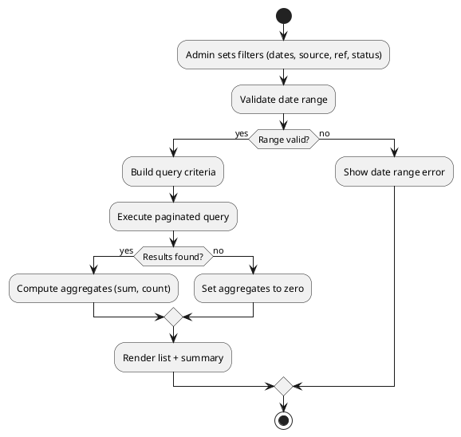
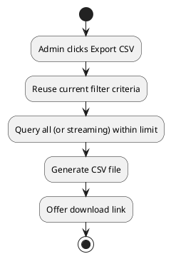
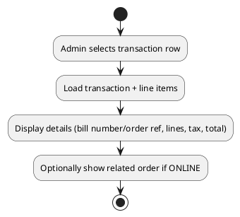

# Admin Use Case: View Transactions

Date: 2025-10-09  
Version: 1.0  
Actor: Admin  
Scope: Retrieve and analyze financial transaction records including POS sales and online order payments.

## 1. Goals
Provide comprehensive visibility into monetary flows for auditing, reconciliation, and anomaly detection.

## 2. Triggers
- Daily reconciliation.
- Audit request.
- Fraud investigation.
- Revenue reporting.

## 3. Stakeholders
| Stakeholder | Interest |
|-------------|----------|
| Admin | Quick access & filtering |
| Finance | Accurate totals |
| Auditor | Integrity and traceability |
| Compliance | Retention & immutability |

## 4. Preconditions
- Admin authenticated.
- Transactions exist.

## 5. Postconditions
- None (read-only). Potential export dataset generated.

## 6. Business Rules
| Rule ID | Description |
|---------|-------------|
| BR-TXN-FILTER-1 | Filters: date range, source (POS/ONLINE), status, amount range, bill/order reference. |
| BR-TXN-PAG-1 | Large result sets paginated (default limit). |
| BR-TXN-SORT-1 | Default sort descending by transaction_date. |
| BR-TXN-IMMUT-1 | Transactions immutable after commit; corrections via adjustment entries (future). |
| BR-TXN-ACCESS-1 | Only Admin (and maybe Finance role) can view full raw details. |

## 7. Main Success Scenario (Filter by Date Range)
1. Admin opens transaction list.
2. Inputs date range and optional source.
3. System validates range (start <= end, max span limit maybe 31 days).
4. System queries with indexes.
5. System returns paginated list & aggregate summary (count, total amount, total tax optional).

## 8. Alternate / Extension Flows
| Flow ID | Description | Variation Point |
|---------|-------------|-----------------|
| A1 | Invalid date range | Step 3: Reject with error |
| A2 | Empty results | Step 5: Show zero summary |
| A3 | Export CSV requested | Post Step 5: Generate CSV |
| A4 | Drill into receipt | Post Step 5: Admin selects entry to view line items |
| A5 | Large span > allowed | Step 3: Enforce limit |

## 9. Activity Diagrams
### 9.1 Filter Transactions

### 9.2 Export Transactions CSV

### 9.3 View Transaction Detail

## 10. Non-Functional Requirements
- Query latency < 2s for 30-day window.
- Indexed columns: transaction_date, source, bill_number/order_ref.
- Secure transport (HTTPS) mandatory.

## 11. Open Issues
| ID | Issue | Impact | Proposed Resolution |
|----|-------|--------|---------------------|
| O1 | No CSV export implemented | Limits reporting | Add endpoint /admin/transactions/export |
| O2 | No aggregation API | UI must compute client-side | Add aggregate query endpoint |
| O3 | Immutable enforcement not coded | Risk of silent edits | Enforce DB constraints / remove update path |

## 12. Conversion
`pandoc .\\docs\\admin\\ADMIN_VIEW_TRANSACTIONS.md -o .\\docs\\admin\\ADMIN_VIEW_TRANSACTIONS.docx`

---
End of Document.
