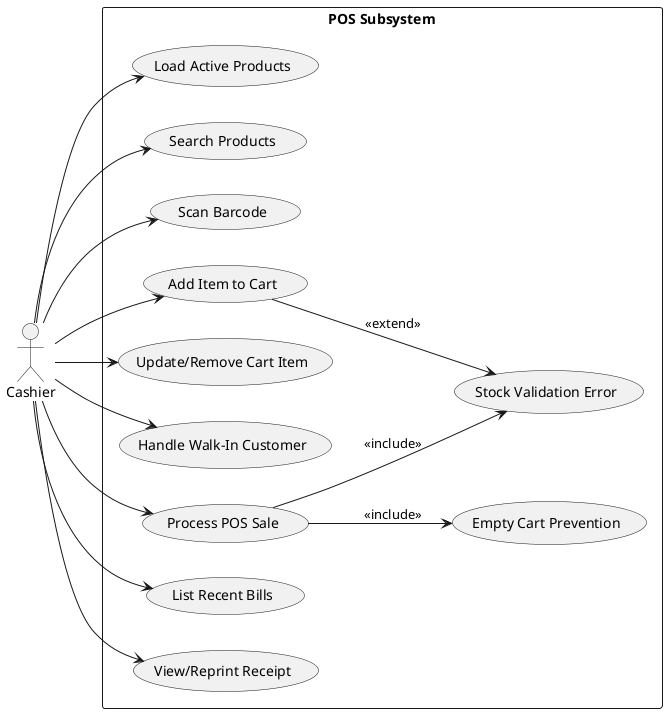
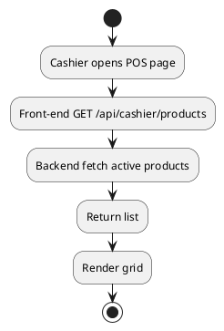
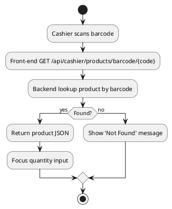
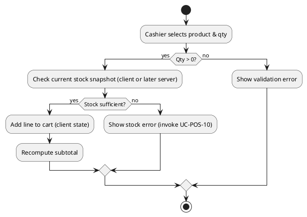
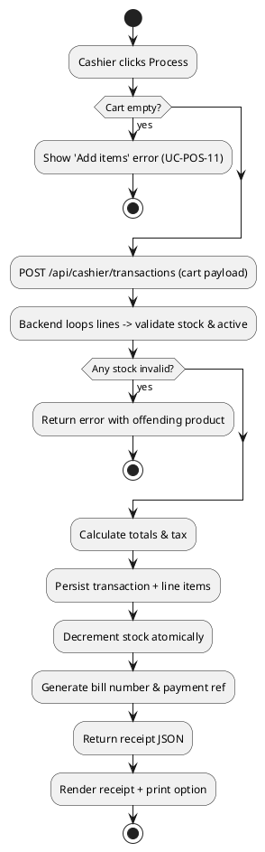
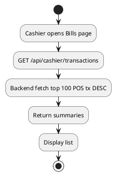
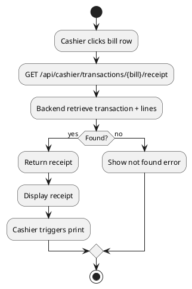
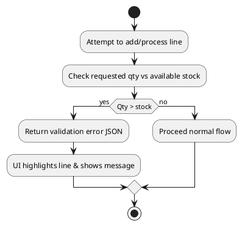

# Cashier POS Use Case Specification (Implemented Scope)

Date: 2025-10-09  
Version: 1.0  
Actor Focus: Cashier (ROLE_CASHIER) operating in-store POS.

## 1. Scope & Truthfulness
This document lists only the POS features actually implemented in the current system. No speculative or future functionality is included.

## 2. Actors
- **Cashier**: Primary actor performing POS operations.
- **System (Backend API)**: Spring Boot services (CashierController / CashierService).

## 3. Implemented Cashier POS Use Cases
| ID | Use Case | Description |
|----|----------|-------------|
| UC-POS-01 | Load Active Products | Retrieve list of active products for selection grid (initial load). |
| UC-POS-02 | Search Products | Filter active products by name substring (client-driven or API param). |
| UC-POS-03 | Scan / Enter Barcode | Lookup single product quickly by barcode/SKU. |
| UC-POS-04 | Add Item to Cart | Insert product with quantity into current sale (in-memory cart in front-end). |
| UC-POS-05 | Update/Remove Cart Item | Adjust quantity or remove line before finalizing sale. |
| UC-POS-06 | Handle Walk-In Customer | Proceed with null customerId if no registered customer selected. |
| UC-POS-07 | Process POS Sale | Submit cart to backend, create transaction, decrement stock, return receipt. |
| UC-POS-08 | List Recent Bills | List up to last 100 POS transactions with optional bill/date filtering. |
| UC-POS-09 | View/Reprint Receipt | Fetch full receipt detail by bill number for display/print. |
| UC-POS-10 | Stock Validation Error | Prevent sale (or line addition) if requested quantity exceeds current stock. |
| UC-POS-11 | Empty Cart Prevention | Block processing when cart has zero items. |

## 4. Use Case Diagram (PlantUML)

## 5. Detailed Use Case Specifications

### UC-POS-01 Load Active Products
- **Actor**: Cashier
- **Preconditions**: Cashier authenticated; products exist and active flag=true.
- **Main Flow**:
  1. Cashier opens POS dashboard.
  2. Front-end requests active products list (no pagination; current set returned).
  3. Backend returns product array (id, name, price, stock, barcode, tax applicability, etc.).
- **Postconditions**: Product grid populated.
- **Exceptions**: Service failure -> show error and retry button.

### UC-POS-02 Search Products
- **Actor**: Cashier
- **Preconditions**: UC-POS-01 executed or search endpoint accessible.
- **Main Flow**:
  1. Cashier inputs part of product name.
  2. Front-end filters locally or requests search API (depending on implemented path).
  3. Display filtered subset.
- **Postconditions**: Filtered list shown.
- **Exceptions**: No matches -> show empty state.

### UC-POS-03 Scan / Enter Barcode
- **Actor**: Cashier
- **Preconditions**: Product with barcode exists and active.
- **Main Flow**:
  1. Cashier scans or types barcode.
  2. Front-end calls barcode lookup endpoint.
  3. Backend returns single product data.
  4. Product auto-focused for quantity entry.
- **Postconditions**: Product ready for addition to cart.
- **Exceptions**: Not found -> error message.

### UC-POS-04 Add Item to Cart
- **Actor**: Cashier
- **Preconditions**: Product loaded (from UC-POS-01/02/03); quantity > 0.
- **Main Flow**:
  1. Cashier sets quantity.
  2. Front-end validates number.
  3. Line item added to in-memory cart; subtotal recalculated.
- **Postconditions**: Cart updated in UI.
- **Exceptions**: Quantity <= 0 -> validation error; Stock insufficient -> UC-POS-10 triggered.

### UC-POS-05 Update/Remove Cart Item
- **Actor**: Cashier
- **Main Flow**:
  1. Cashier changes quantity or removes line.
  2. Front-end updates cart state & recalculates totals.
- **Postconditions**: Updated cart visible.
- **Exceptions**: Quantity becomes 0 -> remove line; Negative input -> revert & notify.

### UC-POS-06 Handle Walk-In Customer
- **Actor**: Cashier
- **Preconditions**: Cart has at least one item.
- **Main Flow**:
  1. Cashier leaves customer selection blank.
  2. Front-end sets customerId=null in sale payload.
- **Postconditions**: Transaction stored with null customerId.
- **Exceptions**: None (walk-in allowed).

### UC-POS-07 Process POS Sale
- **Actor**: Cashier
- **Preconditions**: Cart not empty; each line quantity <= available stock; tax rate configured.
- **Main Flow**:
  1. Cashier clicks "Process/Checkout".
  2. Front-end sends POST with cart lines & optional customerId.
  3. Backend re-validates stock & active status per product.
  4. Backend calculates line totals, tax, grand total.
  5. Backend decrements stock atomically and saves transaction + line items.
  6. Backend generates bill number & payment reference.
  7. Response returns receipt object.
  8. Front-end displays receipt view with print option.
- **Postconditions**: Transaction committed; stock reduced.
- **Exceptions**: Stock changed mid-process -> error response citing item; Empty cart -> UC-POS-11; Validation failure -> rollback.

### UC-POS-08 List Recent Bills
- **Actor**: Cashier
- **Preconditions**: At least one prior POS sale.
- **Main Flow**:
  1. Cashier opens Bills page.
  2. Front-end requests /cashier/transactions (no params) for top 100.
  3. Backend returns summary list descending by date.
- **Postconditions**: Bill summaries shown.
- **Exceptions**: None specific; network error -> retry.

### UC-POS-09 View / Reprint Receipt
- **Actor**: Cashier
- **Preconditions**: Bill exists.
- **Main Flow**:
  1. Cashier selects bill.
  2. Front-end requests receipt endpoint.
  3. Backend returns full receipt (lines, totals, tax, customer if any).
  4. Cashier clicks Print (browser dialog opens).
- **Postconditions**: Physical/printed copy available.
- **Exceptions**: Bill not found -> error toast.

### UC-POS-10 Stock Validation Error (Extension)
- **Actor**: Cashier
- **Trigger**: Adding line or processing sale with quantity > available stock.
- **Flow**:
  1. System detects insufficient stock.
  2. Returns validation error referencing product.
  3. UI highlights the offending line.
- **Outcome**: Line/sale not processed until corrected.

### UC-POS-11 Empty Cart Prevention (Inclusion)
- **Actor**: Cashier
- **Trigger**: Process clicked with zero cart lines.
- **Flow**:
  1. Front-end blocks submit or backend rejects with message.
  2. Cashier adds items first.
- **Outcome**: Prevents empty transaction creation.

## 6. Activity Diagrams
### 6.1 Load Active Products

### 6.2 Scan Barcode

### 6.3 Add Item to Cart

### 6.4 Process POS Sale

### 6.5 List Recent Bills

### 6.6 View / Reprint Receipt

### 6.7 Stock Validation Error (Extension)

## 7. Non-Functional Notes
- All endpoints expected to respond < 1s under normal load (product list + stock checks small dataset).
- Atomicity: Sale processing occurs within a single transactional boundary server-side.

## 8. Excluded (Not Implemented) Features (For Clarity Only)
- Discounts, promotions, coupons.
- Partial payments / split tenders.
- Returns or refunds workflow.
- Inventory reservation / hold system.
- Offline mode / queueing.

## 9. Conversion
`pandoc .\\docs\\cashier\\CASHIER_POS_USE_CASES.md -o .\\docs\\cashier\\CASHIER_POS_USE_CASES.docx`

---
End of Document.
