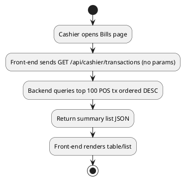
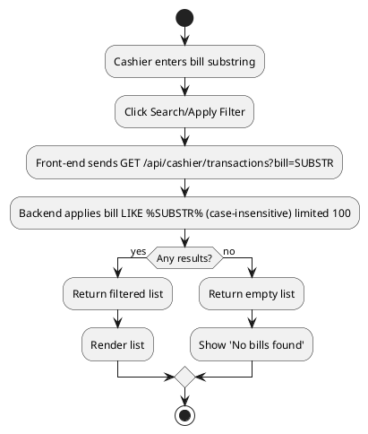
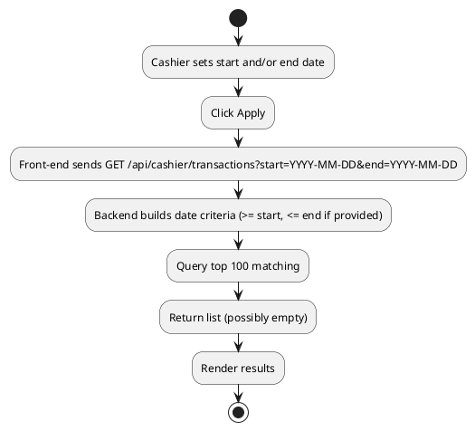
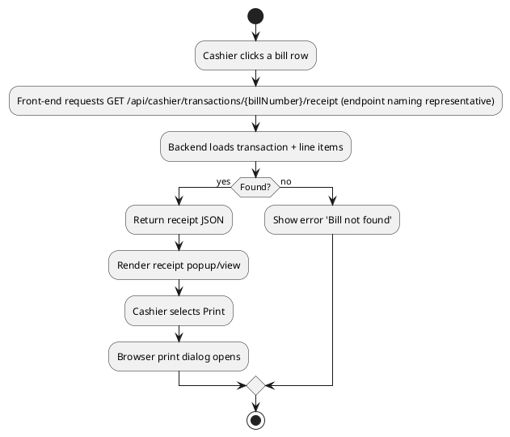

# Cashier Use Case: View POS Transactions (Bills)

Date: 2025-10-09  
Version: 1.0  
Actor: Cashier  
Scope: Listing and viewing previously processed POS sales (bills) limited to the implemented backend features.

## 1. Implemented Feature Set (Truthful Scope)
Included (implemented):
- List up to the most recent 100 POS transactions (source = POS) ordered by transaction date descending.
- Optional filter by bill number substring (case-insensitive) OR by providing start and/or end date (date range filter).
- View a specific receipt by selecting a listed transaction (bill number lookup).
- Print (browser print) of the loaded receipt.
- Walk-in vs registered customer display (walk-in shows a generic/blank customer label if customerId null).

Not Included (NOT implemented; explicitly excluded here):
- Server-side pagination beyond the fixed top 100.
- CSV/Excel export.
- Aggregated totals summary (sum of amounts over filter) on the list endpoint.
- Editing or voiding past transactions.
- Deletion of transactions.
- Advanced filters (product line, cashier user, amount range).

## 2. Goals
Allow the cashier to quickly re-locate a recent bill for reprint or customer inquiry without overloading the database with large scans.

## 3. Triggers
- Customer requests copy of a recent receipt.
- Cashier needs to verify a bill number.

## 4. Stakeholders
| Stakeholder | Interest |
|-------------|----------|
| Cashier | Fast retrieval |
| Customer | Accurate reprinted receipt |
| Admin (indirect) | Consistency with POS transaction records |

## 5. Preconditions
- Cashier authenticated (ROLE_CASHIER) with valid JWT.
- POS transactions exist in database.

## 6. Postconditions
- None (read-only). Receipt may be printed through browser UI.

## 7. Data Elements (Summary DTO Fields Observed)
| Field | Description |
|-------|-------------|
| billNumber | Unique bill identifier (DVPYYYYMMDD####) |
| transactionDate | Timestamp of sale |
| totalAmount | Final total with tax |
| taxAmount | (If included in receipt, per backend) |
| customerId | Nullable; null denotes walk-in |
| customerName (derived UI) | Displayed if registered customer |

(Exact fields depend on POS summary DTO; table reflects implemented concepts.)

## 8. Main Success Scenario (List & Reprint)
1. Cashier navigates to "Bills" page from POS dashboard.
2. System auto-loads recent (max 100) POS transactions (no filters applied yet).
3. Cashier optionally enters partial bill number and submits filter.
4. System returns filtered subset (still capped at 100) or empty if none match.
5. Cashier selects a bill entry.
6. System fetches full receipt details for that bill.
7. Receipt displayed with line items, totals, tax, payment reference (if available), and customer info (or walk-in placeholder).
8. Cashier clicks print; browser print dialog is invoked.

## 9. Alternate Flows
| Flow ID | Condition | Handling |
|---------|-----------|----------|
| A1 | Bill filter yields no results | Display empty state message |
| A2 | Date range entered (start > end) | UI should prevent or system returns validation error (if implemented) |
| A3 | Receipt fetch fails (bill not found - rare) | Show error toast; instruct user to refresh list |
| A4 | Network error mid-request | Show retry option |

## 10. Activity Diagrams
### 10.1 Load Recent Bills

### 10.2 Filter by Bill Substring

### 10.3 Filter by Date Range

### 10.4 View & Print Receipt

## 11. Non-Functional Notes
- Response time target: < 1s for listing (limited by top 100).
- Bill lookup by exact bill number should be indexed (prefix pattern DVP-date).
- Minimal server load due to hard cap; consider pagination only if volume grows.

## 12. Open Issues / Future Enhancements (Not Implemented Yet)
| ID | Idea | Rationale |
|----|------|-----------|
| F1 | Add pagination & page size parameter | Large historical retrieval |
| F2 | Add cashier user filter | Multi-user audit |
| F3 | Export CSV | Accounting reconciliation |
| F4 | Aggregate total for displayed range | Quick financial snapshot |

## 13. Conversion
`pandoc .\\docs\\cashier\\CASHIER_VIEW_POS_TRANSACTIONS.md -o .\\docs\\cashier\\CASHIER_VIEW_POS_TRANSACTIONS.docx`

---
End of Document.
