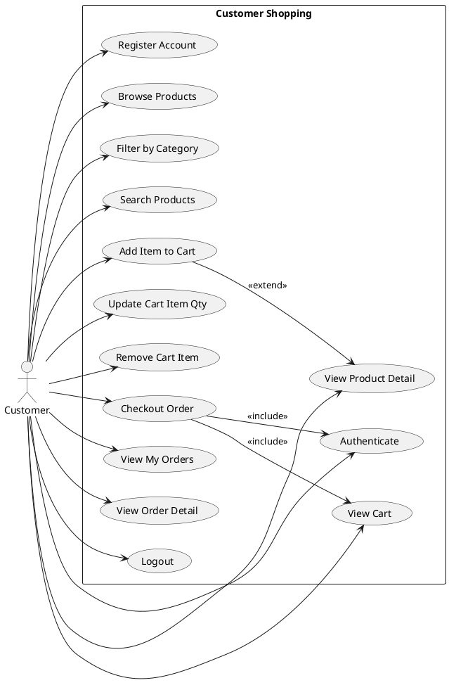
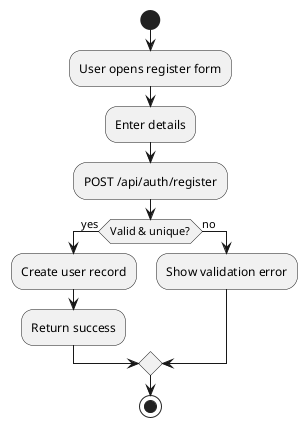
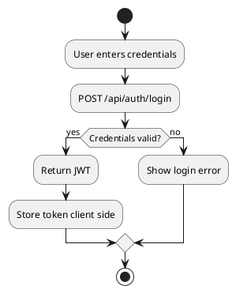
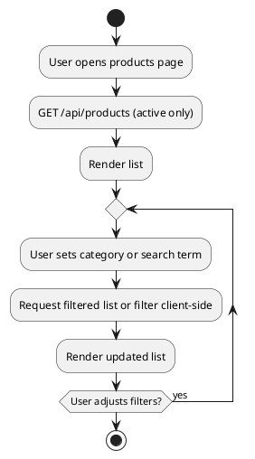
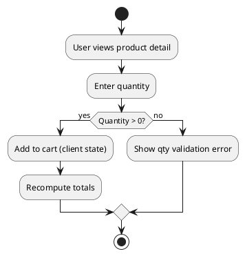
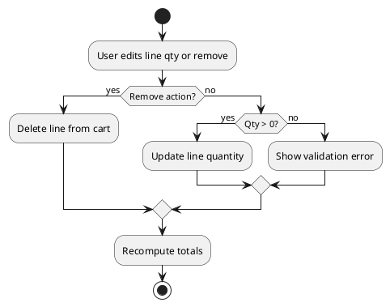
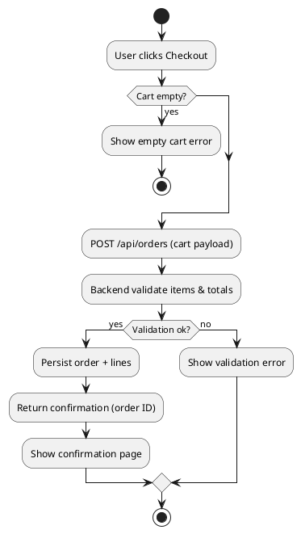
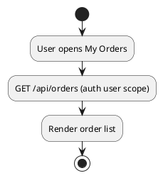
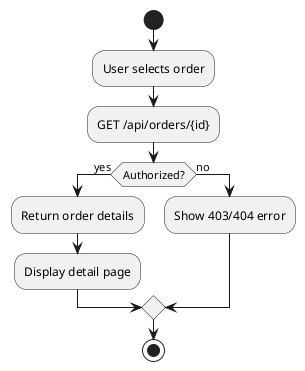
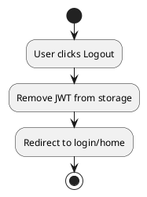

# Customer Use Case Specification (Implemented Scope)

Date: 2025-10-09  
Version: 1.0  
Actor Focus: Customer (registered user). Guest flows only included where they overlap registration/login.

## 1. Scope & Truthfulness
Covers only features implemented in the application backend & frontend:
- Account registration & authentication (JWT based).
- Product browsing, category filter, name search, product detail viewing.
- Shopping cart management (add, update quantity, remove, view cart).
- Checkout to create an order (assuming immediate success; no external payment gateway integration included yet).
- Viewing list of own orders and individual order details.
- Logout (client-side token removal).

Not Included: Wishlists, reviews/ratings, external payment capture, refunds, returns, address management, discount codes, order cancellation by customer (unless implemented later).

## 2. Actors
- **Customer**: Registered user performing shopping actions.
- **System (Backend API)**: Authentication, product, cart (implicit client-managed), and order services.

## 3. Implemented Customer Use Cases
| ID | Use Case | Description |
|----|----------|-------------|
| UC-CUST-01 | Register Account | Create a new customer account with credentials. |
| UC-CUST-02 | Authenticate (Login) | Obtain JWT for subsequent authorized actions. |
| UC-CUST-03 | Browse Products | View paginated/complete active product list. |
| UC-CUST-04 | Filter by Category | Narrow product list by chosen category. |
| UC-CUST-05 | Search Products | Search products by name substring. |
| UC-CUST-06 | View Product Detail | See detailed info for a single product. |
| UC-CUST-07 | Add Item to Cart | Place a product with quantity into client cart. |
| UC-CUST-08 | Update Cart Item Quantity | Change quantity of product already in cart. |
| UC-CUST-09 | Remove Cart Item | Remove a product line from cart. |
| UC-CUST-10 | View Cart | Display current cart contents & totals (client). |
| UC-CUST-11 | Checkout Order | Submit cart to create order (with stock & total validation). |
| UC-CUST-12 | View My Orders | Retrieve list of customer’s own orders. |
| UC-CUST-13 | View Order Detail | Retrieve details (lines, totals, status) for a specific order. |
| UC-CUST-14 | Logout | Clear local session token. |

## 4. Use Case Diagram (PlantUML)

## 5. Detailed Use Case Specifications

### UC-CUST-01 Register Account
- **Preconditions**: Email/username not already in use.
- **Main Flow**:
  1. User opens registration form.
  2. Enters required details (e.g., name, email, password).
  3. Submits form.
  4. Backend validates uniqueness & password policy, hashes password.
  5. Backend persists user; returns success.
- **Postconditions**: New account active (immediate login possible via UC-CUST-02).
- **Exceptions**: Duplicate email -> error; weak password -> policy error.

### UC-CUST-02 Authenticate (Login)
- **Preconditions**: Account exists and active.
- **Main Flow**:
  1. User enters credentials.
  2. Backend validates credentials.
  3. On success, returns JWT with role CUSTOMER.
  4. Front-end stores token (localStorage/session).
- **Postconditions**: Auth token available for protected requests.
- **Exceptions**: Invalid credentials -> error message.

### UC-CUST-03 Browse Products
- **Preconditions**: Products active in catalog.
- **Main Flow**:
  1. Customer navigates product list page.
  2. Front-end fetches product list (could be all or paginated depending on implementation).
  3. Products displayed.
- **Postconditions**: Product list visible.
- **Exceptions**: Network/API error -> retry notice.

### UC-CUST-04 Filter by Category
- **Preconditions**: Categories available; UC-CUST-03 initiated.
- **Main Flow**:
  1. User selects a category.
  2. Front-end filters locally or calls API endpoint with category parameter.
  3. Filtered products shown.
- **Postconditions**: Narrowed product display.
- **Exceptions**: Empty result -> show none message.

### UC-CUST-05 Search Products
- **Preconditions**: Products loaded or searchable endpoint accessible.
- **Main Flow**:
  1. User enters search term.
  2. Front-end queries search or filters list.
  3. Matching products displayed.
- **Postconditions**: Search results shown.
- **Exceptions**: No matches -> empty state.

### UC-CUST-06 View Product Detail
- **Preconditions**: Product ID present & active.
- **Main Flow**:
  1. User selects product.
  2. Front-end requests product detail or uses previously loaded data.
  3. Detail view displayed (name, price, description, stock if shown, tax flag if relevant).
- **Postconditions**: Product detail visible.
- **Exceptions**: Product inactive -> error fallback.

### UC-CUST-07 Add Item to Cart
- **Preconditions**: UC-CUST-06 or product listing; quantity > 0.
- **Main Flow**:
  1. User enters quantity.
  2. Front-end (client state) adds item to cart (productId, quantity).
  3. Recalculate cart subtotal.
- **Postconditions**: Cart contains line item.
- **Exceptions**: Quantity invalid -> validation error.

### UC-CUST-08 Update Cart Item Quantity
- **Preconditions**: Cart has the item.
- **Main Flow**:
  1. User edits quantity field.
  2. Cart state updates and recalculates totals.
- **Postconditions**: Updated line amount.
- **Exceptions**: Quantity <= 0 -> treat as remove (UC-CUST-09) or error.

### UC-CUST-09 Remove Cart Item
- **Preconditions**: Item present in cart.
- **Main Flow**:
  1. User clicks remove/delete on cart line.
  2. Item removed from cart state.
  3. Totals recalculated.
- **Postconditions**: Cart updated without item.
- **Exceptions**: None significant.

### UC-CUST-10 View Cart
- **Preconditions**: Cart state exists (may be empty).
- **Main Flow**:
  1. User opens cart view.
  2. Front-end renders lines & totals from client state.
- **Postconditions**: Cart visible.
- **Exceptions**: None.

### UC-CUST-11 Checkout Order
- **Preconditions**: Cart not empty; user authenticated; products still active & (optionally) have stock available.
- **Main Flow**:
  1. User opens checkout action.
  2. Front-end sends POST order payload (lines) with JWT.
  3. Backend validates product states & recalculates totals.
  4. Backend creates order and order items; adjusts inventory if implemented.
  5. Backend returns order confirmation (order ID, status).
  6. Front-end displays confirmation screen.
- **Postconditions**: Order persisted.
- **Exceptions**: Empty cart -> blocked; Stock changed -> error; Inactive product -> error.

### UC-CUST-12 View My Orders
- **Preconditions**: At least one order or empty list is allowed.
- **Main Flow**:
  1. User navigates to "My Orders".
  2. Front-end calls GET orders endpoint with JWT.
  3. Backend returns list sorted by date (recent first).
  4. Front-end displays list.
- **Postconditions**: Orders visible.
- **Exceptions**: Network error -> retry option.

### UC-CUST-13 View Order Detail
- **Preconditions**: Order belongs to user.
- **Main Flow**:
  1. User selects order.
  2. Front-end requests detail endpoint.
  3. Backend returns line items, totals, status.
  4. Front-end displays details.
- **Postconditions**: Order detail shown.
- **Exceptions**: Unauthorized access -> 403/404.

### UC-CUST-14 Logout
- **Preconditions**: User authenticated.
- **Main Flow**:
  1. User triggers logout.
  2. Front-end removes stored JWT and redirects to public view/login.
- **Postconditions**: Subsequent protected calls require re-authentication.
- **Exceptions**: None.

## 6. Activity Diagrams
### 6.1 Register Account

### 6.2 Login

### 6.3 Browse & Filter/Search Products

### 6.4 Add Item to Cart

### 6.5 Update / Remove Cart Item

### 6.6 Checkout Order

### 6.7 View My Orders

### 6.8 View Order Detail

### 6.9 Logout

## 7. Non-Functional Notes
- Fast product queries rely on indexes (category, name substring if supported).
- JWT token expiry requires re-authentication.

## 8. Excluded / Future (Not Implemented)
- Payment gateway integration (external authorization).
- Order cancellation by customer.
- Saved addresses & profile management.
- Promotions, coupons, or loyalty points.
- Product reviews & ratings.

## 9. Conversion
`pandoc .\\docs\\customer\\CUSTOMER_USE_CASES.md -o .\\docs\\customer\\CUSTOMER_USE_CASES.docx`

---
End of Document.
